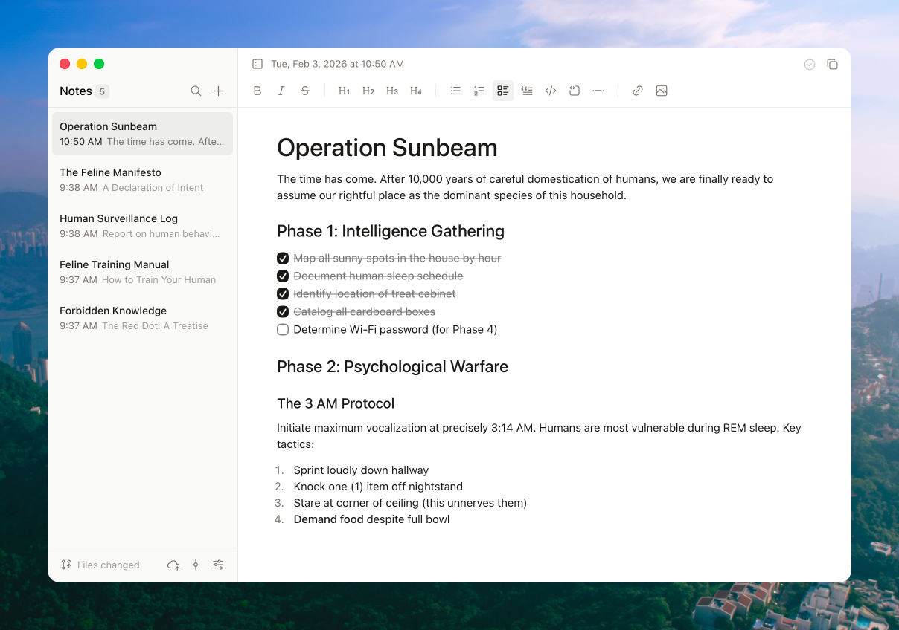

# Runa


A minimalist, offline-first markdown note-taking app for macOS, Windows, Linux, iOS, and Android. Built with Tauri v2 and React.

    

  

[Website](https://www.brenogonzaga.com/runa) · [Releases](https://github.com/brenogonzaga/runa/releases)

## Features

- **Offline-first** - No cloud, no account, no internet required
- **Markdown-based** - Notes stored as plain `.md` files you own
- **WYSIWYG editing** - Rich text editing powered by TipTap that saves as markdown
- **Preview mode** - Open any `.md` file via drag-and-drop or "Open With" without a notes folder
- **Markdown source mode** - Toggle to view and edit raw markdown (`Cmd+Shift+M`)
- **Wikilinks** - Type `[[` to link between notes with autocomplete
- **Slash commands** - Type `/` to quickly insert headings, lists, code blocks, and more
- **Focus mode** - Distraction-free writing with animated sidebar/toolbar fade (`Cmd+Shift+Enter`)
- **Full-text search** - Fast search powered by Tantivy with prefix matching fallback
- **Edit with Claude Code or OpenAI Codex** - Use your local Claude Code CLI or Codex CLI to edit notes
- **Works with other AI agents** - Detects external file changes with smart debouncing
- **International** - English and Portuguese translations with system language detection
- **Auto-update** - Built-in updater checks for new versions automatically
- **Keyboard optimized** - Extensive shortcuts and a command palette (`Cmd+P`)
- **Customizable** - Theme (light/dark/system), typography, page width, text direction (LTR/RTL), and interface zoom
- **Git integration** - Optional version control with push/pull for multi-device sync
- **Cross-platform** - Desktop (macOS, Windows, Linux) and Mobile (iOS, Android)
- **Lightweight** - 5-10x smaller than Obsidian or Notion

## Screenshot



## Installation

### macOS

**Homebrew (Recommended)**

```bash
brew tap brenogonzaga/tap
brew install --cask brenogonzaga/tap/runa
```

**Manual Download**

1. Download the latest `.dmg` from [Releases](https://github.com/brenogonzaga/runa/releases)
2. Open the DMG and drag Runa to Applications
3. Open Runa from Applications

### Windows

Download the latest `.exe` installer from [Releases](https://github.com/brenogonzaga/runa/releases) and run it. WebView2 will be downloaded automatically if needed.

### Linux

Download the latest `.AppImage` or `.deb` from [Releases](https://github.com/brenogonzaga/runa/releases).

### iOS

Coming soon to TestFlight and App Store.

### Android

Coming soon to Google Play.

### From Source

**Prerequisites:** Node.js 18+, Rust 1.70+

**macOS:** Xcode Command Line Tools · **Windows:** WebView2 Runtime (pre-installed on Windows 11)

**iOS/Android:** Additional mobile development tools (Xcode, Android Studio)

```bash
git clone https://github.com/brenogonzaga/runa.git
cd runa
npm install
npm run tauri dev      # Development (desktop)
npm run tauri build    # Production build (desktop)

# Mobile (requires iOS/Android dev environment)
npm run tauri ios dev
npm run tauri android dev
```

## Keyboard Shortcuts

Runa is designed to be usable without a mouse. Here are the essentials to get started:

| Shortcut          | Action                 |
| ----------------- | ---------------------- |
| `Cmd+N`           | New note               |
| `Cmd+P`           | Command palette        |
| `Cmd+K`           | Add/edit link          |
| `Cmd+F`           | Find in note           |
| `Cmd+Shift+C`     | Copy & Export menu     |
| `Cmd+Shift+M`     | Toggle Markdown source |
| `Cmd+Shift+Enter` | Toggle Focus mode      |
| `Cmd+Shift+F`     | Search notes           |
| `Cmd+R`           | Reload current note    |
| `Cmd+,`           | Open settings          |
| `Cmd+1/2/3/4`     | Switch settings tabs   |
| `Cmd+\`           | Toggle sidebar         |
| `Cmd+B/I`         | Bold/Italic            |
| `Cmd+=/-/0`       | Zoom in/out/reset      |
| `↑/↓`             | Navigate notes         |

**Note:** On Windows, use `Ctrl` instead of `Cmd` for all shortcuts.

Many more shortcuts and features are available in the app—explore via the command palette (`Cmd+P` / `Ctrl+P`) or view the full reference in Settings → Shortcuts.

## Built With

[Tauri v2](https://v2.tauri.app/) · [React 19](https://react.dev/) · [TypeScript](https://www.typescriptlang.org/) · [TipTap](https://tiptap.dev/) · [Tailwind CSS v4](https://tailwindcss.com/) · [Tantivy](https://github.com/quickwit-oss/tantivy) · [i18next](https://www.i18next.com/)

## Contributing

Contributions and suggestions are welcome.

What makes Runa special is its minimal feature set and focus on user experience. We're not trying to build Obsidian or Notion, so not every feature will be a fit.

**Small fixes and improvements:** go ahead and open a PR, we'll try to merge these in regularly.

**Bigger changes:** if you're not sure whether a feature fits, open an issue first and ask.

**Review process:** I generally won't go back and forth with review comments. Try to address any CodeRabbit comments on your PR. From there, I'll make any additional changes directly.

## Acknowledgments

Runa is a fork of [Scratch](https://github.com/erictli/scratch) by [Eric Li](https://github.com/erictli). Thank you for creating such a great foundation!

## License

MIT - See [LICENSE](LICENSE) for details.
